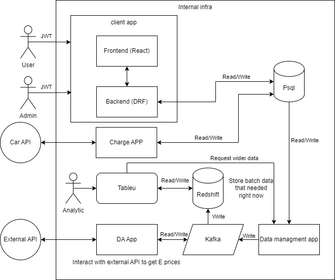
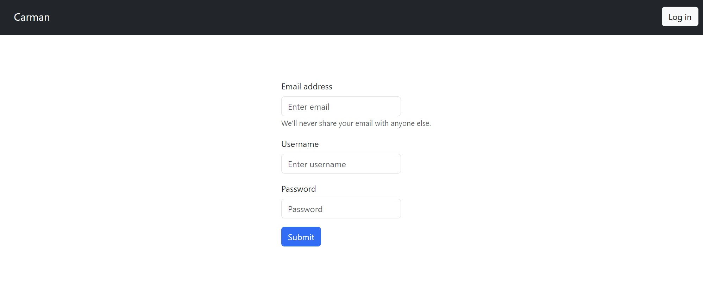
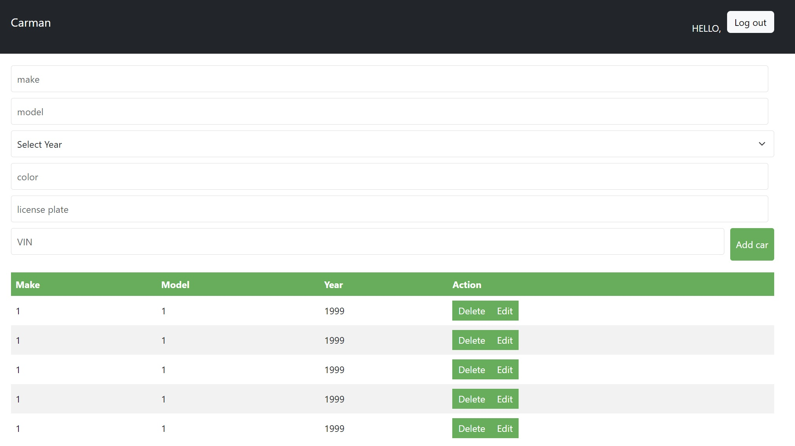

# Carman - Car Management System

## Description

Carman is a car management system that allows users to manage their cars. Users can add, update, delete, and view cars. The system also allows users to view the car's details, such as the car's make, model, year, and price. The system also allows users to search for cars based on the car's make, model, year, and price.

## Architecture

## Features

- Login
- Register
- Add Car
...

## Installation

1. Clone the repository
2. backend
    - `cd backend`
    - `pip install -r requirements.txt`
    - `python manage.py runserver`
3. frontend
    - `cd frontend`
    - `npm install`
    - `npm run start`
4. Optional: NGINX on 80 port
    - `docker-compose up --build`

## Technologies

- Django
- Django REST Framework
- React
- Axios
- Docker
- NGINX

## Screenshots

